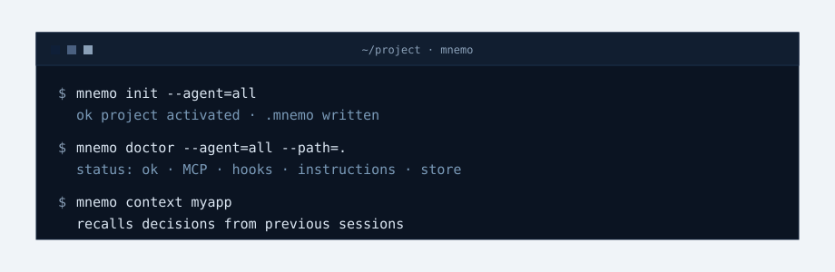

<p align="center">
  
</p>

<h1 align="center">mnemo</h1>

<p align="center">
  <strong>Memoria persistente para agentes de programación.</strong>
</p>

<p align="center">
  Dale a Claude Code, Codex, Cursor, Windsurf y OpenCode una memoria local compartida que sobrevive a sesiones, compactaciones y cambios de agente.
</p>

<p align="center">
  <a href="README.md">English</a> · <a href="README.es.md">Español</a>
</p>

<p align="center">
  <a href="https://go.dev"></a>
  <a href="https://github.com/jmeiracorbal/mnemo"></a>
  <a href="https://sqlite.org"></a>
  <a href="https://github.com/jmeiracorbal/mnemo"></a>
  <a href="LICENSE"></a>
</p>

<p align="center">
  <a href="#inicio-rapido">Inicio rápido</a> ·
  <a href="#por-que-mnemo">Por qué mnemo</a> ·
  <a href="#agentes-soportados">Agentes</a> ·
  <a href="#documentacion">Documentación</a> ·
  <a href="ROADMAP.md">Roadmap</a>
</p>

---

## ¿Qué es mnemo?

mnemo es una capa de memoria local para desarrollo con agentes. Guarda decisiones, bugs, convenciones, descubrimientos y resúmenes de sesión en SQLite, y los expone de vuelta a los agentes mediante herramientas MCP, hooks y Agent Skills portables.

En lugar de repartir conocimiento entre `MEMORY.md`, memorias nativas del editor, transcripciones y notas humanas, mnemo ofrece a todos los agentes soportados una misma fuente de verdad por proyecto.

<p align="center">
  
</p>

<a id="inicio-rapido"></a>

## Inicio rápido

Instala el binario y configura los agentes detectados:

```bash
curl -sSf https://raw.githubusercontent.com/jmeiracorbal/mnemo/main/install.sh | bash
```

Activa mnemo en un proyecto:

```bash
cd tu-proyecto
mnemo init --agent=all
```

Comprueba que todo está conectado:

```bash
mnemo doctor --agent=all --path=.
```

Guarda y busca memoria manualmente desde CLI:

```bash
mnemo save "Usar SQLite FTS5" "La búsqueda queda local, rápida y sin dependencias externas." --type decision --project miapp
mnemo search "SQLite" --project miapp
```

<a id="por-que-mnemo"></a>

## Por qué mnemo

| Problema | mnemo aporta |
|---|---|
| Los agentes olvidan decisiones entre sesiones | Memoria persistente de proyecto en `~/.mnemo/memory.db` |
| Cada agente mantiene una memoria distinta | Una capa compartida para Claude Code, Codex, Cursor, Windsurf y OpenCode |
| Los archivos markdown de memoria se desordenan | Observaciones estructuradas, tags, topic keys y estados de revisión |
| Los hooks globales pueden ser peligrosos | Activación opt-in por proyecto mediante `.mnemo`; el resto se ignora |
| El setup puede fallar en silencio | `mnemo doctor` y `mnemo setup status` explican qué está configurado |
| Se acumulan proyectos o memorias duplicadas | Herramientas de merge de proyectos y curación de memoria |

## Funcionalidades

| Funcionalidad | Qué hace |
|---|---|
| **Activación por proyecto** | Los hooks globales solo actúan cuando existe una marca `.mnemo` válida. |
| **Herramientas MCP** | Los agentes pueden usar `mem_save`, `mem_search`, `mem_context`, `mem_current_project`, `mem_doctor` y más. |
| **Hooks de sesión** | Registran sesiones, inyectan contexto y capturan aprendizajes automáticamente. |
| **Agent Skills portables** | Enseñan a los agentes compatibles cuándo y cómo usar mnemo sin recurrir a memoria nativa. |
| **Captura pasiva** | Extrae aprendizajes útiles de transcripciones y salidas de subagentes. |
| **Diagnóstico** | `mnemo doctor` comprueba activación, setup global, MCP, hooks, memorias competidoras y salud del store. |
| **Mantenimiento de proyectos** | `mnemo projects list` y `mnemo projects merge` consolidan identidades duplicadas. |
| **Curación de memoria** | `mnemo memories review` detecta observaciones duplicadas o conflictivas para reparación aprobada. |

## Agentes soportados

| Agente | MCP | Hooks / runtime | Instrucciones globales | Skills | Estado |
|---|---:|---:|---:|---:|---|
| Claude Code | ✅ | Plugin o n/a vía `install.sh` | ✅ | ✅ | Soportado |
| Codex | ✅ | ✅ | ✅ | ✅ | Soportado |
| Cursor | ✅ | ✅ | ✅ | ✅ | Soportado |
| Windsurf | ✅ | ✅ | ✅ | ✅ | Soportado |
| OpenCode | ✅ | ✅ | ✅ | ✅ | Soportado |

El setup global se instala una vez. La activación del proyecto sigue siendo local y explícita:

```text
project/
├── .mnemo      # ID de proyecto + agentes activados, ignorado por git
├── AGENTS.md   # autoridad de memoria compartida
├── CLAUDE.md   # reglas específicas de Claude cuando se selecciona
└── .cursor/    # reglas de Cursor cuando se selecciona
```

## Verlo en acción

<p align="center">
  
</p>

```text
$ mnemo doctor --agent=all --path=.
status: ok
checks: project marker, binary, MCP, hooks, instructions, store

$ mnemo context miapp
## Memoria de sesiones anteriores
- Se eligió SQLite FTS5 para búsqueda local.
- Los hooks refrescados deben conservar permisos de ejecución.

$ mnemo memories review --project=miapp
No potential memory conflicts found.
```

## Opciones de instalación

| Vía | Cuándo usarla | Comando |
|---|---|---|
| Instalador automático | Quieres binario + setup de agentes detectados | <code>curl -sSf https://raw.githubusercontent.com/jmeiracorbal/mnemo/main/install.sh &#124; bash</code> |
| Agente explícito | Solo quieres una integración | `bash -s -- --agent=codex` |
| Todos los agentes | Quieres preparar todas las integraciones | `bash -s -- --agent=all` |
| Plugin de Claude | Usas el marketplace de Claude Code | `claude plugin install mnemo@mnemo` |
| Build desde fuente | Desarrollas mnemo | `go build -o ~/.local/bin/mnemo ./cmd/mnemo/` |

Consulta la guía completa en [docs/INSTALLATION.md](docs/INSTALLATION.md).

<a id="documentacion"></a>

## Documentación

| Guía | Contenido |
|---|---|
| [Instalación](docs/INSTALLATION.md) | Instalador, plugin, activación de proyecto y verificación. |
| [Integración con agentes](docs/AGENT_INTEGRATION.md) | Hooks, rutas globales, marca `.mnemo` y Agent Skills. |
| [Referencia CLI](docs/CLI.md) | Comandos, ejemplos, herramientas MCP y modos de búsqueda. |
| [Troubleshooting](docs/TROUBLESHOOTING.md) | `doctor`, `setup status`, comprobaciones manuales e idempotencia. |
| [Storage](docs/STORAGE.md) | Ubicación SQLite, esquema y flujo sqlc. |
| [Roadmap](ROADMAP.md) | Trabajo planificado de producto y mantenimiento. |

## Principios de diseño

- **Local-first:** la memoria permanece en tu máquina en SQLite.
- **Neutral entre agentes:** una sola autoridad de memoria para todos los agentes soportados.
- **Opt-in por proyecto:** las integraciones globales no actúan sin `.mnemo`.
- **Diagnosticable:** cada superficie de setup puede comprobarse sin modificar nada.
- **Reparable:** duplicados de proyecto y conflictos de memoria son visibles y corregibles desde CLI.

## Licencia

[Apache 2.0](LICENSE): puedes usar, modificar y distribuir libremente, conservando el aviso de copyright e incluyendo [NOTICE](NOTICE) en las distribuciones.
