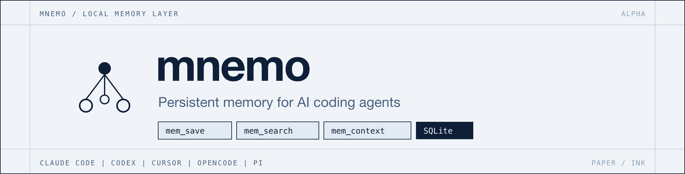
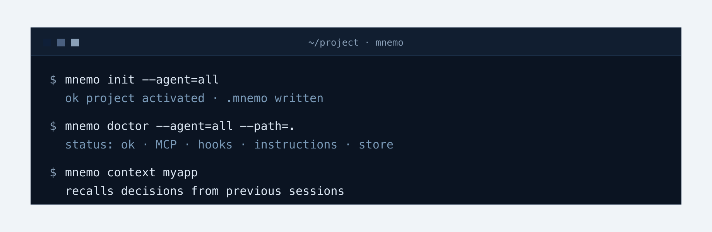
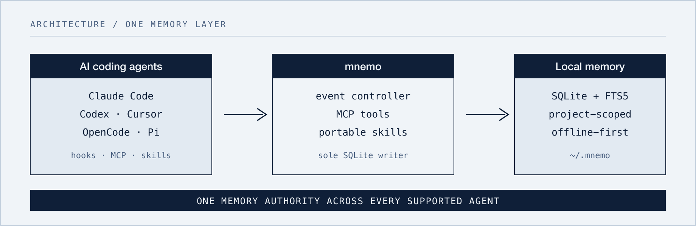

<p align="center">
  <a href="https://jmeiracorbal.github.io/mnemo/">
    
  </a>
</p>

<p align="center">
  <a href="https://jmeiracorbal.github.io/mnemo/">
    
  </a>
</p>

<p align="center">
  <strong>Una misma fuente de verdad para Claude Code, Codex, Cursor, OpenCode y Pi.</strong>
</p>

<p align="center">
  <a href="README.md">English</a> ·
  <a href="README.es.md">Español</a> ·
  <a href="README.zh-CN.md">简体中文</a>
</p>

<p align="center">
  <a href="LICENSE"></a>
  <a href="https://github.com/jmeiracorbal/mnemo/releases"></a>
  <a href="https://github.com/jmeiracorbal/mnemo/stargazers"></a>
  <a href="https://go.dev"></a>
  <a href="https://sqlite.org"></a>
  <a href="https://github.com/jmeiracorbal/mnemo"></a>
</p>

<p align="center">
  
  
  
  
  
</p>

<p align="center">
  <a href="#inicio-rapido">Inicio rápido</a> ·
  <a href="#por-que-mnemo">Por qué mnemo</a> ·
  <a href="#como-funciona">Cómo funciona</a> ·
  <a href="#agentes-soportados">Agentes</a> ·
  <a href="#documentacion">Documentación</a> ·
  <a href="#comunidad">Comunidad</a> ·
  <a href="ROADMAP.md">Roadmap</a>
</p>

<p align="center">
  
</p>

---

<a id="por-que-mnemo"></a>

## Por qué mnemo

Los agentes olvidan. La memoria en markdown se desordena. Los hooks compiten. El setup falla en silencio.

| Sin mnemo | Con mnemo |
|---|---|
| Las decisiones desaparecen entre sesiones | Memoria durable de proyecto en SQLite local |
| `MEMORY.md`, memoria del editor y notas divergen | Una sola fuente de verdad por proyecto para todos los agentes soportados |
| Los hooks globales corren en todas partes o en ninguna útil | Opt-in con `.mnemo`; proyectos sin marca se ignoran |
| Fallos silenciosos de configuración | `mnemo doctor` explica exactamente qué está cableado |

mnemo no afirma soportar todo harness. Ofrece un contrato de memoria estable que cualquier harness puede implementar y validar.

<a id="inicio-rapido"></a>

## Inicio rápido

```bash
# 1. Instalar (fija la alpha actual)
curl -sSf https://raw.githubusercontent.com/jmeiracorbal/mnemo/main/install.sh | MNEMO_VERSION=v1.0.0-alpha.4 bash

# 2. Activar en un proyecto
cd tu-proyecto
mnemo init --agent=all

# 3. Verificar
mnemo doctor --agent=all --path=.
```

Luego en tu agente: `mem_save` una decisión, cierra la sesión, abre otra — `mem_search` / `mem_context` la encuentra.

```bash
mnemo search "SQLite" --project "$(mnemo json id < .mnemo)"
```

Las instalaciones sin versión y `mnemo update` siguen releases estables por defecto. Usa `mnemo update --prerelease` para alphas y betas. Rutas de instalación, updates y setup por agente: [Installation](https://github.com/jmeiracorbal/mnemo/wiki/Installation).

<a id="como-funciona"></a>

## Cómo funciona

<p align="center">
  
</p>

1. **Los agentes** hablan con mnemo mediante herramientas MCP, hooks y Agent Skills portables.
2. **Un controller local de eventos** es el único escritor normal de SQLite — los publicadores no abren la base.
3. **Las memorias** permanecen en tu máquina: observaciones estructuradas, tags, topic keys y resúmenes de sesión en SQLite + FTS5.

```text
project/
├── .mnemo      # ID de proyecto + agentes activados (gitignored)
├── AGENTS.md   # autoridad de memoria compartida
├── CLAUDE.md   # reglas de Claude cuando se selecciona
├── .cursor/    # reglas de Cursor cuando se selecciona
└── .pi/        # extensiones de prompt de Pi cuando se selecciona
```

Consulta [Durable Events](https://github.com/jmeiracorbal/mnemo/wiki/Durable-Events) para entrega y errores.

## Destacados

- **Activación por proyecto** — hooks globales inertes sin `.mnemo` válida
- **MCP + herramientas nativas** — `mem_save`, `mem_search`, `mem_context`, `mem_doctor` y más
- **Controller de eventos durables** — JetStream por usuario; transacciones SQLite idempotentes
- **Sesiones del controller** — IDs nativos de ejecución vinculados a una sesión canónica
- **Skills portables** — enseñan a usar mnemo en lugar de memoria nativa
- **Captura pasiva** — extrae aprendizajes del output del agente
- **Provenance** — metadatos consultables en SQL (agente, tool, modelo, cliente MCP)
- **Diagnóstico y reparación** — `mnemo doctor`, merge/rename de proyectos, `mnemo memories review`
- **Migraciones seguras y auto-update** — schema al abrir; `mnemo update` para releases

<a id="agentes-soportados"></a>

## Agentes soportados

| Agente | MCP | Hooks / runtime | Instrucciones globales | Skill | Estado |
|---|---:|---:|---:|---:|---|
| Claude Code | Sí | Hooks del plugin o setup del instalador | Sí | Sí | Soportado |
| Codex | Sí | Hooks de sesión | Sí | Sí | Soportado |
| Cursor | Sí | Hook de prompt | Sí | Sí | Soportado |
| OpenCode | Sí | Eventos del plugin | Sí | Sí | Soportado |
| Pi | Herramientas nativas | Extensión nativa | Sí | Sí | Soportado |

Codex exige revisión interactiva de confianza de hooks tras instalar — detalles en [Agent Integrations](https://github.com/jmeiracorbal/mnemo/wiki/Agent-Integrations).

## Módulos asociados

| Módulo | Propósito |
|---|---|
| [`mnemo-adapters`](https://github.com/jmeiracorbal/mnemo-adapters) | Interfaces y mappings de adapters para CLI, controller y MCP |
| [`mnemo-events`](https://github.com/jmeiracorbal/mnemo-events) | Contratos de eventos y comandos durables compartidos |

## Opciones de instalación

| Vía | Comando |
|---|---|
| Alpha actual (`v1.0.0-alpha.4`) | <code>curl -sSf https://raw.githubusercontent.com/jmeiracorbal/mnemo/main/install.sh &#124; MNEMO_VERSION=v1.0.0-alpha.4 bash</code> |
| Última estable | <code>curl -sSf https://raw.githubusercontent.com/jmeiracorbal/mnemo/main/install.sh &#124; bash</code> |
| Un agente | `bash -s -- --agent=codex` |
| Todos los agentes | `bash -s -- --agent=all` |
| Plugin de Claude | `claude plugin install mnemo@mnemo` |
| Desde fuente | `go build -o ~/.local/bin/mnemo ./cmd/mnemo/` |

Flags de update y desinstalación: [Installation](https://github.com/jmeiracorbal/mnemo/wiki/Installation).

<a id="documentacion"></a>

## Documentación

| Guía | Contenido |
|---|---|
| [Wiki](https://github.com/jmeiracorbal/mnemo/wiki) | Documentación de usuario y navegación |
| [Instalación](https://github.com/jmeiracorbal/mnemo/wiki/Installation) | Binario, controller, activación, updates |
| [Integración con agentes](https://github.com/jmeiracorbal/mnemo/wiki/Agent-Integrations) | ID nativos, hooks, tools, confianza Codex |
| [Eventos durables](https://github.com/jmeiracorbal/mnemo/wiki/Durable-Events) | Arquitectura del controller y fallos |
| [Referencia CLI](https://github.com/jmeiracorbal/mnemo/wiki/CLI-Reference) | Comandos, MCP tools, modos de búsqueda |
| [Diagnóstico](https://github.com/jmeiracorbal/mnemo/wiki/Troubleshooting) | Diagnósticos y recuperación del controller |
| [Almacenamiento](https://github.com/jmeiracorbal/mnemo/wiki/Storage-and-Migrations) | SQLite, migraciones, sqlc |
| [Roadmap](ROADMAP.md) | Trabajo planificado de producto y mantenimiento |

## Principios de diseño

- **Local-first** — la memoria permanece en tu máquina en SQLite
- **Neutral entre agentes** — una sola autoridad de memoria para todos los agentes soportados
- **Opt-in por proyecto** — las integraciones globales no actúan sin `.mnemo`
- **Diagnosticable** — cada superficie de setup se comprueba sin mutar
- **Reparable** — duplicados de proyecto y conflictos de memoria visibles y corregibles por CLI

<a id="comunidad"></a>

## Comunidad

Si mnemo mejora tu flujo con agentes, dale una estrella al repo: señala que la memoria local y neutra entre agentes merece construirse.

- [Contributing](CONTRIBUTING.md) — build, tests y PRs
- [Code of Conduct](CODE_OF_CONDUCT.md) — normas de la comunidad
- [Security](SECURITY.md) — reporte privado de vulnerabilidades
- [Site](https://jmeiracorbal.github.io/mnemo/) · [Wiki](https://github.com/jmeiracorbal/mnemo/wiki) · [Roadmap](ROADMAP.md)

## Licencia

[Apache 2.0](LICENSE): puedes usar, modificar y distribuir libremente; conserva el aviso de copyright e incluye [NOTICE](NOTICE) en las distribuciones.
