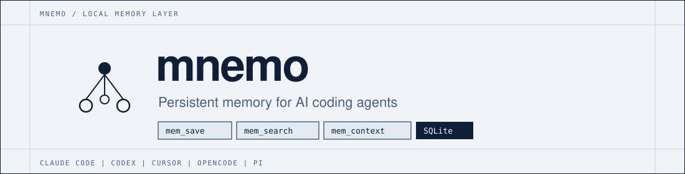

<p align="center">
  <a href="https://jmeiracorbal.github.io/mnemo/">
    
  </a>
</p>

<p align="center">
  <strong>Same source of truth across Claude Code, Codex, Cursor, OpenCode and Pi.</strong>
</p>

<p align="center">
  <a href="README.md">English</a> ·
  <a href="README.es.md">Español</a> ·
  <a href="README.zh-CN.md">简体中文</a>
</p>

<p align="center">
  <a href="LICENSE"></a>
  <a href="https://github.com/jmeiracorbal/mnemo/releases"></a>
  <a href="https://github.com/jmeiracorbal/mnemo/stargazers"></a>
  <a href="https://go.dev"></a>
  <a href="https://sqlite.org"></a>
  <a href="https://github.com/jmeiracorbal/mnemo"></a>
</p>

<p align="center">
  
  
  
  
  
</p>

<p align="center">
  <a href="#quick-start">Quick Start</a> ·
  <a href="#why-mnemo">Why mnemo?</a> ·
  <a href="#how-it-works">How it works</a> ·
  <a href="#supported-agents">Agents</a> ·
  <a href="#documentation">Docs</a> ·
  <a href="#community">Community</a> ·
  <a href="ROADMAP.md">Roadmap</a>
</p>

<p align="center">
  
</p>

---

## Why mnemo?

Agents forget. Markdown memory drifts. Hooks race. Setup fails silently.

| Without mnemo | With mnemo |
|---|---|
| Decisions vanish between sessions | Durable project memory in local SQLite |
| `MEMORY.md`, editor memory and chat notes diverge | One project-scoped source of truth for every supported agent |
| Global hooks run everywhere, or nowhere useful | Opt-in via `.mnemo`; unmarked projects are ignored |
| Silent misconfiguration | `mnemo doctor` explains exactly what is wired |

mnemo does not claim every harness. It ships a stable memory contract that any harness can implement and validate.

## Quick Start

```bash
# 1. Install (pins current alpha)
curl -sSf https://raw.githubusercontent.com/jmeiracorbal/mnemo/main/install.sh | MNEMO_VERSION=v1.0.0-alpha.4 bash

# 2. Activate in a project
cd your-project
mnemo init --agent=all

# 3. Verify
mnemo doctor --agent=all --path=.
```

Then in your agent: `mem_save` a decision, close the session, open another — `mem_search` / `mem_context` finds it.

```bash
mnemo search "SQLite" --project "$(mnemo json id < .mnemo)"
```

Unpinned installs and `mnemo update` follow stable releases by default. Use `mnemo update --prerelease` for alphas and betas. Full install paths, updates and agent-specific setup live in the [Installation](https://github.com/jmeiracorbal/mnemo/wiki/Installation) guide.

## How it works

<p align="center">
  
</p>

1. **Agents** talk to mnemo through MCP tools, hooks and portable Agent Skills.
2. **A local event controller** is the sole normal SQLite writer — publishers never open the database.
3. **Memories** stay on your machine: structured observations, tags, topic keys and session summaries in SQLite + FTS5.

```text
project/
├── .mnemo      # project ID + activated agents (gitignored)
├── AGENTS.md   # shared memory authority
├── CLAUDE.md   # Claude rules when selected
├── .cursor/    # Cursor rules when selected
└── .pi/        # Pi prompt extensions when selected
```

See [Durable Events](https://github.com/jmeiracorbal/mnemo/wiki/Durable-Events) for delivery and failure semantics.

## Highlights

- **Project-scoped activation** — global hooks stay inert without a valid `.mnemo`
- **MCP + native tools** — `mem_save`, `mem_search`, `mem_context`, `mem_doctor`, and more
- **Durable event controller** — JetStream per user; idempotent SQLite transactions
- **Controller-owned sessions** — agent-native execution IDs bind to one canonical session
- **Portable skills** — teach agents to use mnemo instead of falling back to native memory
- **Passive capture** — extract learnings from agent-provided output
- **Provenance** — SQL-queryable agent, tool, model and MCP client metadata
- **Diagnostics & repair** — `mnemo doctor`, project merge/rename, `mnemo memories review`
- **Safe migrations & self-update** — schema upgrades on open; `mnemo update` for releases

## Supported Agents

| Agent | MCP | Hooks / runtime | Global instructions | Skill | Status |
|---|---:|---:|---:|---:|---|
| Claude Code | Yes | Plugin hooks or installer setup | Yes | Yes | Supported |
| Codex | Yes | Session hooks | Yes | Yes | Supported |
| Cursor | Yes | Prompt hook | Yes | Yes | Supported |
| OpenCode | Yes | Plugin events | Yes | Yes | Supported |
| Pi | Native tools | Native extension | Yes | Yes | Supported |

Codex requires an interactive hook trust review after install — details in [Agent Integrations](https://github.com/jmeiracorbal/mnemo/wiki/Agent-Integrations).

## Associated modules

| Module | Purpose |
|---|---|
| [`mnemo-adapters`](https://github.com/jmeiracorbal/mnemo-adapters) | Agent adapter interfaces and mappings for CLI, controller and MCP |
| [`mnemo-events`](https://github.com/jmeiracorbal/mnemo-events) | Durable event and command contracts shared by publishers, controller and store |

## Installation options

| Path | Command |
|---|---|
| Current alpha (`v1.0.0-alpha.4`) | <code>curl -sSf https://raw.githubusercontent.com/jmeiracorbal/mnemo/main/install.sh &#124; MNEMO_VERSION=v1.0.0-alpha.4 bash</code> |
| Latest stable | <code>curl -sSf https://raw.githubusercontent.com/jmeiracorbal/mnemo/main/install.sh &#124; bash</code> |
| One agent | `bash -s -- --agent=codex` |
| All agents | `bash -s -- --agent=all` |
| Claude plugin | `claude plugin install mnemo@mnemo` |
| From source | `go build -o ~/.local/bin/mnemo ./cmd/mnemo/` |

Full update flags and uninstall steps: [Installation](https://github.com/jmeiracorbal/mnemo/wiki/Installation).

## Documentation

| Guide | Contents |
|---|---|
| [Wiki home](https://github.com/jmeiracorbal/mnemo/wiki) | User documentation and navigation |
| [Installation](https://github.com/jmeiracorbal/mnemo/wiki/Installation) | Binary, controller, activation, updates |
| [Agent integrations](https://github.com/jmeiracorbal/mnemo/wiki/Agent-Integrations) | Native IDs, hooks, tools, Codex trust |
| [Durable events](https://github.com/jmeiracorbal/mnemo/wiki/Durable-Events) | Controller architecture and failure behavior |
| [CLI reference](https://github.com/jmeiracorbal/mnemo/wiki/CLI-Reference) | Commands, MCP tools, search modes |
| [Troubleshooting](https://github.com/jmeiracorbal/mnemo/wiki/Troubleshooting) | Diagnostics and controller recovery |
| [Storage](https://github.com/jmeiracorbal/mnemo/wiki/Storage-and-Migrations) | SQLite, migrations, sqlc |
| [Roadmap](ROADMAP.md) | Planned product and maintenance work |

## Design principles

- **Local-first** — memory stays on your machine in SQLite
- **Agent-neutral** — one memory authority across supported coding agents
- **Opt-in by project** — global integrations are inert without `.mnemo`
- **Diagnosable** — every setup surface can be checked without mutation
- **Repairable** — duplicate projects and memory conflicts are visible and fixable via CLI

## Community

Star the repo if mnemo helps your agent workflow — it signals that local, agent-neutral memory is worth building.

- [Contributing](CONTRIBUTING.md) — build, test, and open a PR
- [Code of Conduct](CODE_OF_CONDUCT.md) — community standards
- [Security](SECURITY.md) — private vulnerability reporting
- [Site](https://jmeiracorbal.github.io/mnemo/) · [Wiki](https://github.com/jmeiracorbal/mnemo/wiki) · [Roadmap](ROADMAP.md)

## License

[Apache 2.0](LICENSE): use, modify and distribute freely; retain the copyright notice and include [NOTICE](NOTICE) in all distributions.
