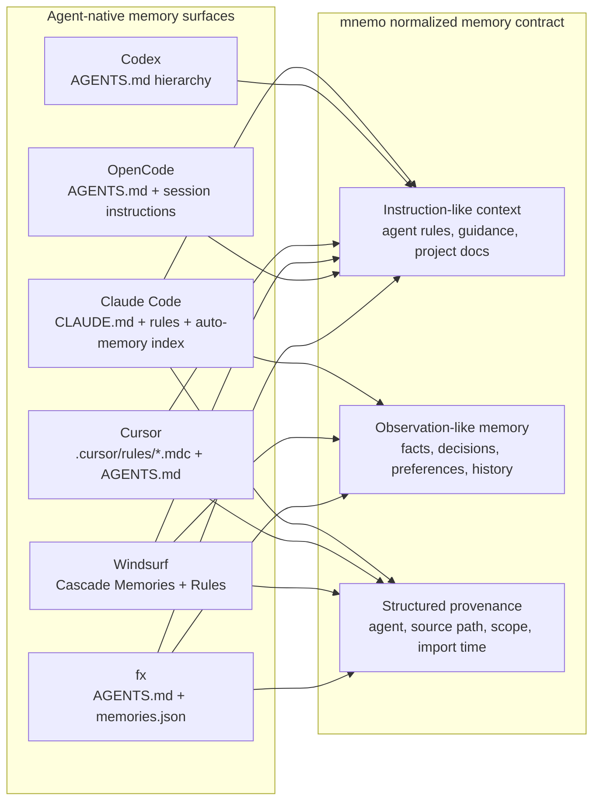

# Agent memory surfaces

This directory records how the agents currently supported by mnemo store or load their own memory-like context. It is intended to inform a future `mnemo memories ingest` / conversion feature, not to replace the canonical mnemo store.

## Scope

The notes focus on durable surfaces that an importer can reasonably inspect:

- user- or project-authored instruction files;
- agent-generated local memory files when documented or visible;
- rule directories that users often use as long-lived memory;
- schema and provenance that should be preserved when converting into mnemo observations.

Conversation transcripts, opaque editor state, cloud-only state, and model-provider context are out of scope unless the agent exposes a documented export/import path.

## Summary matrix

| Agent | Native memory surface | Primary import candidates | Conversion confidence |
|---|---|---|---|
| Claude Code | `CLAUDE.md`, `.claude/rules/`, auto memory markdown under `~/.claude/projects/<project>/memory/` | `CLAUDE.md`, `.claude/CLAUDE.md`, `.claude/rules/**/*.md`, `CLAUDE.local.md`, auto-memory `MEMORY.md` index plus referenced topic files | High for markdown files; medium for auto memory classification |
| Codex | `AGENTS.md` / `AGENTS.override.md` instruction aggregation | `$CODEX_HOME/AGENTS*.md`, repo/nested `AGENTS*.md`, configured fallback names when discoverable | High for markdown instructions; no native semantic memory store documented |
| Cursor | Rules (`.cursor/rules/*.mdc`), User Rules, Team Rules, `AGENTS.md` | `.cursor/rules/**/*.mdc`, `AGENTS.md`, legacy `.cursorrules` if present | High for project rules; low for opaque/editor-managed memories |
| Windsurf | Cascade Memories plus Rules / `AGENTS.md` | `~/.codeium/windsurf/memories/`, `~/.codeium/windsurf/memories/global_rules.md`, `.windsurf/rules/**/*.md`, `AGENTS.md`, legacy `.windsurfrules` if present | Medium for generated Memories; high for Rules |
| OpenCode | `AGENTS.md` instruction discovery and session instruction deltas | `~/.config/opencode/AGENTS.md`, repo/nested `AGENTS.md` | High for markdown instructions; low for session internals |
| fx | `AGENTS.md` project instructions plus `~/.fx/memories.json` | `~/.fx/AGENTS.md`, repo/nested `AGENTS.md`, `~/.fx/memories.json` | High for JSON string memories and AGENTS.md |

## Memory equivalence diagram

### Equivalence model

| mnemo target concept | Claude Code | Codex | Cursor | Windsurf | OpenCode | fx |
|---|---|---|---|---|---|---|
| Instruction-like context | `CLAUDE.md`, `.claude/CLAUDE.md`, `.claude/rules/**/*.md` | `AGENTS.md` hierarchy | `.cursor/rules/**/*.mdc`, `AGENTS.md` | `.windsurf/rules/**/*.md`, `AGENTS.md` | `AGENTS.md` hierarchy | `AGENTS.md` hierarchy |
| Observation-like memory | Auto-memory `MEMORY.md` index plus referenced topic files | Not documented as a native store | No documented local semantic store | Cascade Memories | Not documented as a native store | `~/.fx/memories.json` strings |
| Scope signal | User/project/local memory locations | File hierarchy and fallback names | Rule type/path metadata | Workspace/user memory and rule locations | File hierarchy | Profile-level memories plus project instructions |
| Provenance to preserve | Source file, heading/topic path, auto-memory reference target | Source file and nearest project path | Rule file, frontmatter, referenced `@file` paths | Memory/rule path and activation metadata | Source file and nearest project path | JSON array entry index and profile path |

This equivalence is intentionally conservative: mnemo should preserve where each memory came from and whether it behaved like an instruction or an observation before turning it into canonical mnemo data.

## Index and reference patterns

| Agent | Has a `MEMORY.md`-style index? | Importer note |
|---|---:|---|
| Claude Code | Yes | Treat auto-memory `MEMORY.md` as an index/entrypoint and follow referenced topic files for full memory bodies. |
| Codex | No | `AGENTS.md` files are direct instruction inputs; hierarchy is scope/precedence, not a memory manifest. |
| Cursor | No central memory index | `.mdc` rules are direct import units, but rule bodies may reference supporting files with `@file` links; preserve/follow those separately. |
| Windsurf | No documented memory index | Generated Memories are local workspace items; Rules are direct files with activation metadata, not a manifest. |
| OpenCode | No | `AGENTS.md` files and discovered nested instructions are direct instruction sources; V2 config `instructions` entries are parsed but not resolved into model context. |
| fx | No | `~/.fx/memories.json` is the direct memory store: a JSON array of strings. `AGENTS.md` files are scoped instructions. |

## Importer design implications

- Treat instruction files and memories differently. Rules often contain behavioral directives; auto memories tend to be facts, preferences, or historical decisions.
- Preserve source path, agent, scope, heading, and import timestamp as structured mnemo provenance.
- Default to dry-run. Some systems mix project knowledge, user preferences, and policy-like instructions in the same file.
- Do not import secrets or credentials. Rule and memory files may contain private data because agents read them as context.
- Keep `.mnemo` guardrails authoritative. The importer should not write to mnemo unless it is run for a valid mnemo project or with an explicit project target.

## Sources

- Claude Code memory docs: https://code.claude.com/docs/en/memory
- OpenAI Codex agent loop: https://openai.com/index/unrolling-the-codex-agent-loop/
- Codex AGENTS.md discovery source: https://raw.githubusercontent.com/openai/codex/main/codex-rs/core/src/agents_md.rs
- Cursor Rules docs: https://prod.cursor.com/docs/rules
- Windsurf Cascade Memories and Rules docs: https://docs.windsurf.com/es/windsurf/cascade/memories
- OpenCode V2 instructions docs: https://opencode.ai/v2/docs/instructions
- fx project instructions docs: https://fx.sh/docs/configure-fx/project-instructions
- fx memory tool source: https://raw.githubusercontent.com/vercel-labs/fx/main/src/tools/memory/memory.zig
- fx profile paths source: https://raw.githubusercontent.com/vercel-labs/fx/main/src/core/shared/profile_paths.zig
